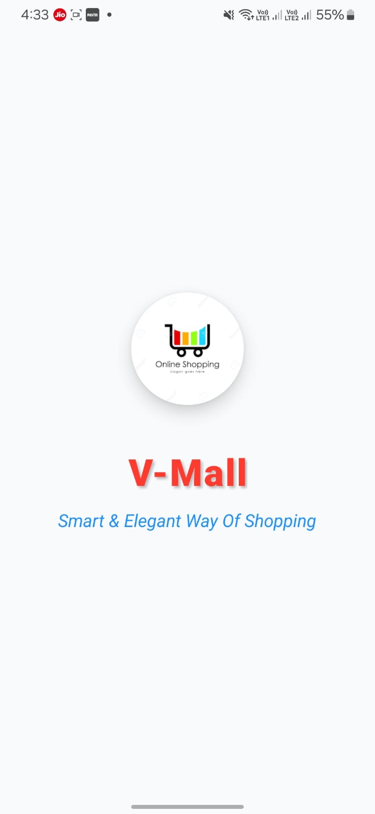
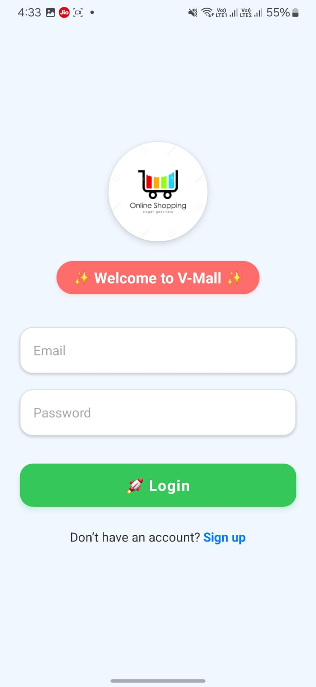
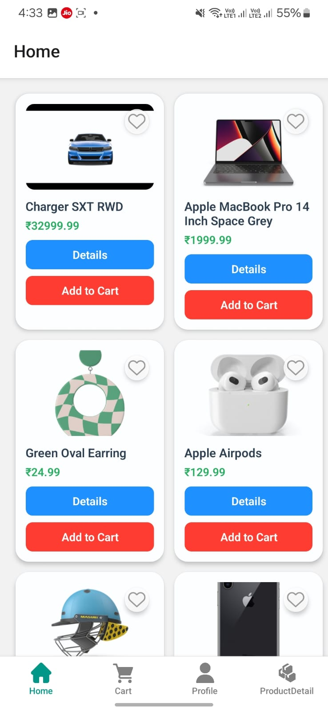
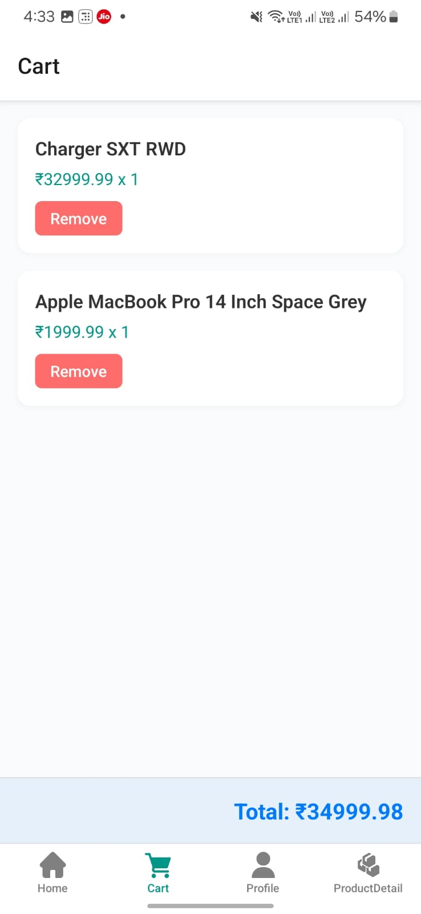
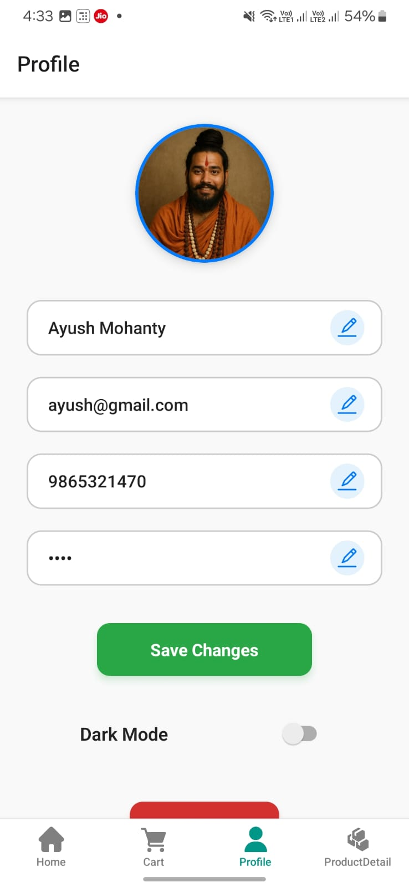

# 🛍️ V-Mall – Smart & Elegant Way of Shopping

V-Mall is a modern, mobile-first shopping app built using **React Native** and **Expo**. It provides an elegant experience for browsing products, managing wishlists, adding to cart, and editing user profiles.

---

## 📱 Features

- 🔐 User Authentication (Login / Signup)
- 🛒 Add & Remove from Cart
- ❤️ Wishlist / Favorites System
- 👤 Profile Management with Editable Info and Image Picker
- 🌙 Light & Dark Mode Toggle
- 🧠 Persistent Storage via AsyncStorage
- 🌐 Smooth Navigation with Stack & Tab Navigators
- 🎉 Animated Welcome Screen

---

## 🖼️ Screenshots

> Place these image files in the `assets/` folder in your project root or inside `docs/assets/` and adjust paths accordingly.

| Welcome | Login | Home | Cart | Profile |
|--------|-------|------|------|---------|
|  |  |  |  |  |

---

## 🎥 App Demo (Video)

> GitHub does not support embedding videos directly. Use a GIF or link to a YouTube/Google Drive video.

### ▶️ Watch the demo:
[](https://drive.google.com/file/d/YOUR_VIDEO_ID/view?usp=sharing)

Alternatively, you can embed a GIF like this:

```md

